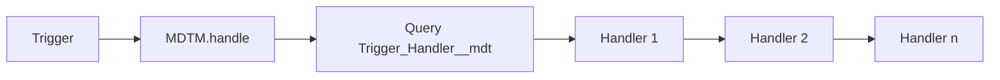

# MDTM — Metadata-Driven Trigger Management

**MDTM** is a small Apex trigger framework for Salesforce. You register handler classes on **Custom Metadata** (`Trigger_Handler__mdt`), ordered and activatable per environment, and call a single line from each trigger: `MDTM.handle()`.

<a href="https://githubsfdeploy.herokuapp.com?owner=ReSourcePro&repo=MDTM&ref=main">
  
</a>

---

## Why MDTM?

| Capability | What you get |
|------------|----------------|
| **Configuration as metadata** | Handler classes, order, and on/off flags live in **Custom Metadata**, so they move cleanly **sandbox → production** with the same deploy pipeline you already use (change sets, SFDX, CI). No copying lists of class names in Custom Settings or hard-coding in Apex. |
| **Explicit load order** | **`Load_Order__c`** controls execution order per object. |
| **Activate / deactivate without deploy** | **`Active__c`** on each metadata row turns a handler off while keeping configuration in source. |
| **Runtime toggles (per transaction)** | **`MDTM.TriggerEvent`** lets you enable or disable **all handlers for an object**, or **one handler class**, for a specific trigger phase—**including in the middle of a trigger run** (same transaction). Useful for recursion control, feature flags, or emergency cutoffs. |
| **Thin triggers** | One line per object; behavior lives in testable handler classes implementing narrow interfaces (`BeforeInsert`, `AfterUpdate`, …). |

Many “trigger framework” approaches rely on **code-only** registration (static lists, maps, or single giant dispatcher class). That is hard to diff across orgs and often requires a **deployment** to add or reorder logic. **MDTM keeps the trigger stub stable** and pushes **which** class runs, **in what order**, and **whether it is on** into **versioned metadata**.

---

## How it works

1. For each sObject, you add **one** Apex trigger that calls `MDTM.handle()`.
2. At run time (outside tests), MDTM loads **`Trigger_Handler__mdt`** rows for that object where **`Active__c = true`**, ordered by **`Load_Order__c`**.
3. For each row, MDTM resolves **`Class__c`** with `Type.forName`, instantiates your handler, and calls the right method for the current trigger context (before/after, insert/update/delete/undelete).



---

## Custom Metadata: `Trigger_Handler__mdt`

| Field | Purpose |
|--------|---------|
| **`Object__c`** | API name of the sObject (e.g. `Contact`, `Account`). Must match `'' + SObjectType` for that object. |
| **`Class__c`** | Fully qualified Apex class name (e.g. `MyHandler` or `Namespace.MyHandler`). Must extend `MDTM.Handler` and implement the right `MDTM.*` interfaces. |
| **`Load_Order__c`** | Numeric order; lower values run first. |
| **`Active__c`** | If unchecked, that handler is skipped (still deployable). |

Example metadata row (illustrative):

```xml
<!-- force-app/main/default/customMetadata/Trigger_Handler.My_Contact_Handler.md-meta.xml -->
<?xml version="1.0" encoding="UTF-8"?>
<CustomMetadata xmlns="http://soap.sforce.com/2006/04/metadata" ...>
    <label>My Contact Handler</label>
    <values>
        <field>Active__c</field>
        <value xsi:type="xsd:boolean">true</value>
    </values>
    <values>
        <field>Class__c</field>
        <value xsi:type="xsd:string">ContactEmailUppercase_MDTM</value>
    </values>
    <values>
        <field>Load_Order__c</field>
        <value xsi:type="xsd:double">10</value>
    </values>
    <values>
        <field>Object__c</field>
        <value xsi:type="xsd:string">Contact</value>
    </values>
</CustomMetadata>
```

---

## Handler class

Extend **`MDTM.Handler`** and implement the event interfaces you need (e.g. `MDTM.BeforeInsert`, `MDTM.AfterUpdate`). Only matching methods are invoked.

```apex
public with sharing class ContactEmailUppercase_MDTM extends MDTM.Handler
    implements MDTM.BeforeInsert, MDTM.BeforeUpdate {

    public void onBeforeInsert(List<SObject> records) {
        apply((List<Contact>) records);
    }

    public void onBeforeUpdate(List<SObject> records, Map<Id, SObject> existingRecordsMap) {
        apply((List<Contact>) records);
    }

    private void apply(List<Contact> contacts) {
        for (Contact c : contacts) {
            if (c.Email != null) {
                c.Email = c.Email.toUpperCase();
            }
        }
    }
}
```

---

## Trigger (one line)

Register **one** trigger per object (events as required):

```apex
trigger Contact_MDTM on Contact (before insert, before update) {
    MDTM.handle();
}
```

---

## Runtime: enable / disable handlers (including mid-trigger)

MDTM evaluates two **`TriggerEvent`** gates per handler row:

1. **Object-level** — `MDTM.getTriggerSObjectTypeEvent('Contact')` (or pass `Contact.SObjectType`).
2. **Handler-level** — `MDTM.getTriggerHandlerEvent(MyHandler.class)` (pass the handler **Type**).

Each gate defaults to **all events enabled**. Call **`disable…`** / **`enable…`** for the phases you care about (`BeforeInsert`, `AfterUpdate`, etc.). If **either** gate says the current phase is off, that handler is skipped.

**Disable every handler for Contact before insert** (e.g. skip enrichment for a specific code path):

```apex
MDTM.getTriggerSObjectTypeEvent(Contact.SObjectType).disableBeforeInsert();
// ... your logic ...
MDTM.getTriggerSObjectTypeEvent(Contact.SObjectType).enableBeforeInsert();
```

**Disable only one handler class** (e.g. stop recursion for `MyRecursionProneHandler`):

```apex
MDTM.getTriggerHandlerEvent(MyRecursionProneHandler.class).disableAfterUpdate();
```

**Mid-trigger:** the same APIs work from code invoked during the trigger transaction (helper methods, service classes, etc.). State is held in static maps for the **current Apex transaction**; reset is not automatic across transactions—design your enable/disable pairs for the paths you control.

---

## Unit tests (no Custom Metadata rows required)

In `@IsTest`, MDTM uses **`MDTM.setupTestHandlers(List<Trigger_Handler__mdt>)`** with **in-memory** `new Trigger_Handler__mdt(...)` rows (no metadata in the repo needed for tests). Call **`MDTM.resetInternalStateForTests()`** when you need a clean slate in a test.

```apex
@IsTest
private class MyHandler_Test {
    @IsTest
    static void runsBeforeInsert() {
        MDTM.resetInternalStateForTests();
        MDTM.setupTestHandlers(new List<Trigger_Handler__mdt>{
            new Trigger_Handler__mdt(
                Object__c = 'Contact',
                Class__c = 'ContactEmailUppercase_MDTM',
                Active__c = true,
                Load_Order__c = 1
            )
        });

        Contact c = new Contact(LastName = 'Test', Email = 'a@b.com');
        MDTM.TriggerContext ctx = new MDTM.TriggerContext();
        ctx.isBefore = true;
        ctx.isInsert = true;
        ctx.newRecords = new List<Contact>{ c };

        MDTM.handle(Contact.SObjectType, ctx);

        System.assertEquals('A@B.COM', c.Email);
    }
}
```

---

## Repository layout (this project)

- `force-app/main/default/classes/MDTM.cls` — framework.
- `force-app/main/default/objects/Trigger_Handler__mdt/` — Custom Metadata Type definition.
- `force-app/main/default/classes/MDTMTest.cls` — framework tests.
- Example: `Contact_MDTM.trigger`, `ContactEmailUppercase_MDTM.cls`, sample `Trigger_Handler.*` metadata.

---

## License

Add your license here when you publish the GitHub repo.
